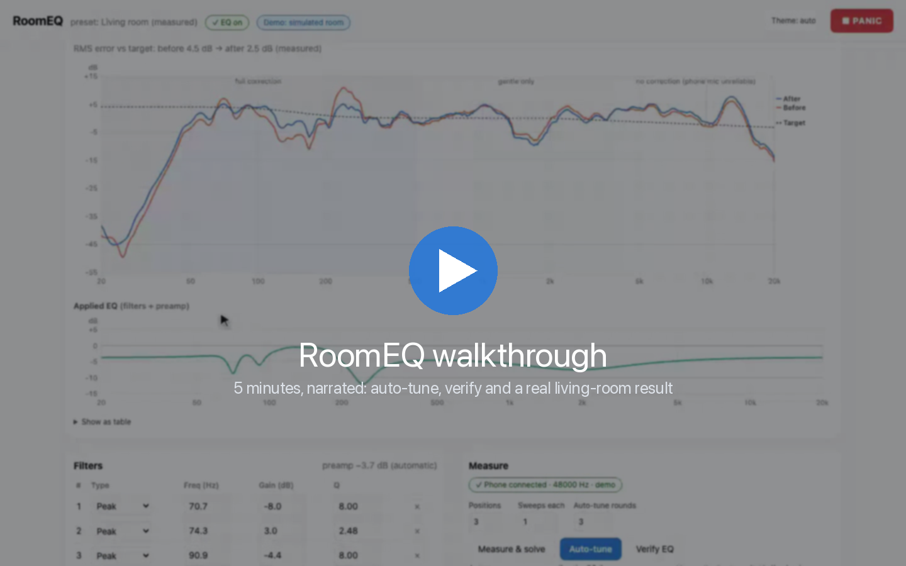
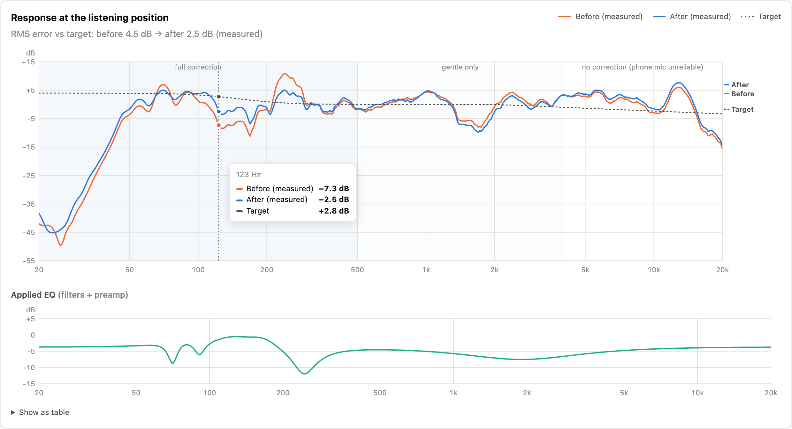
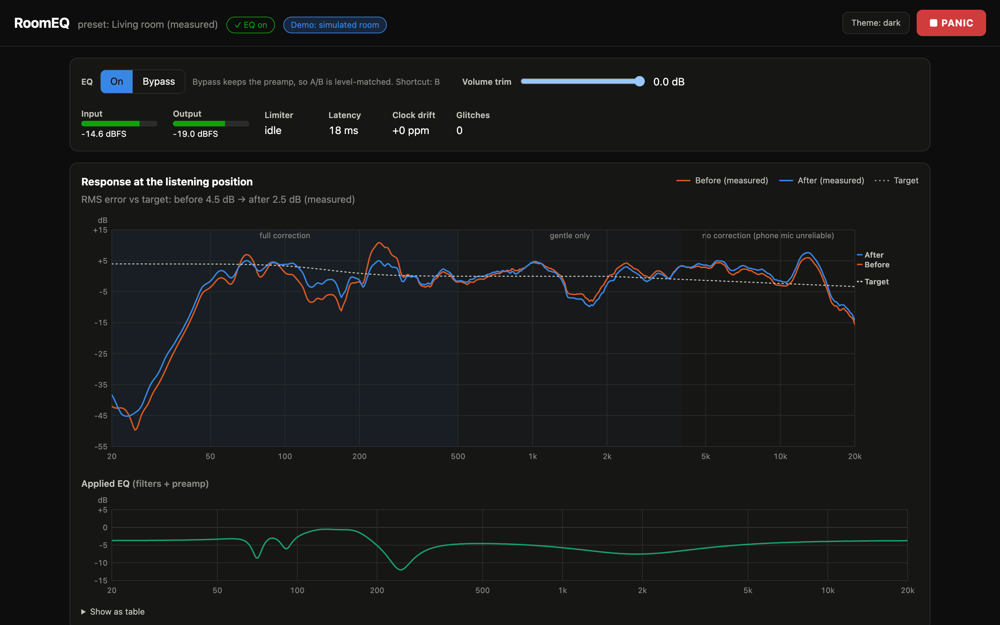
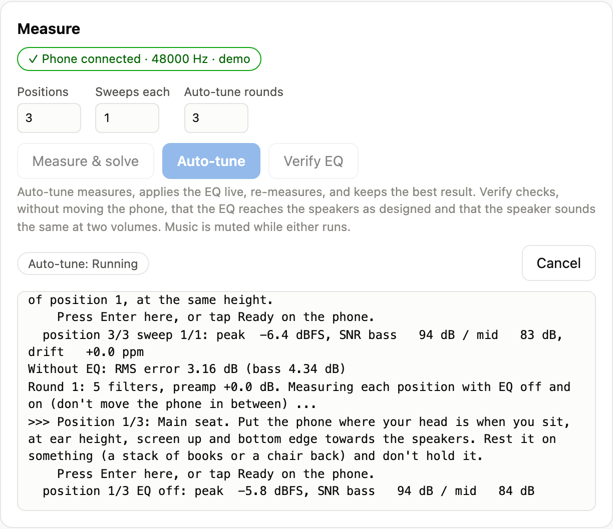
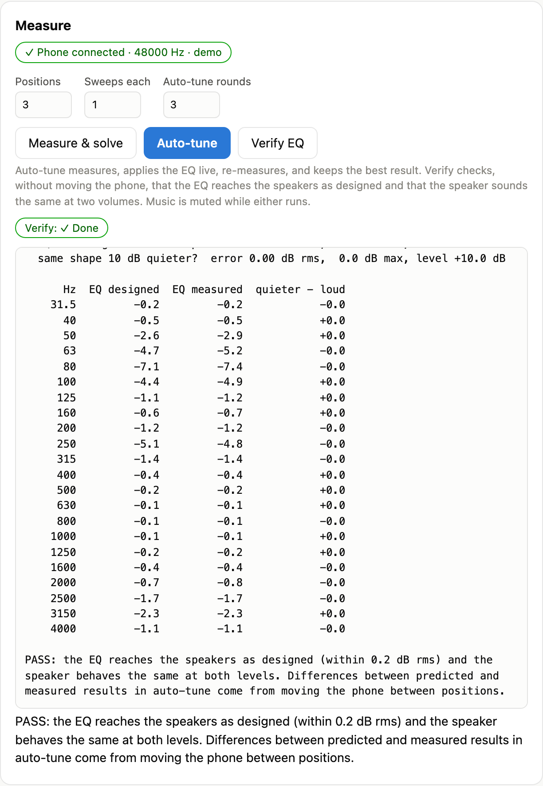
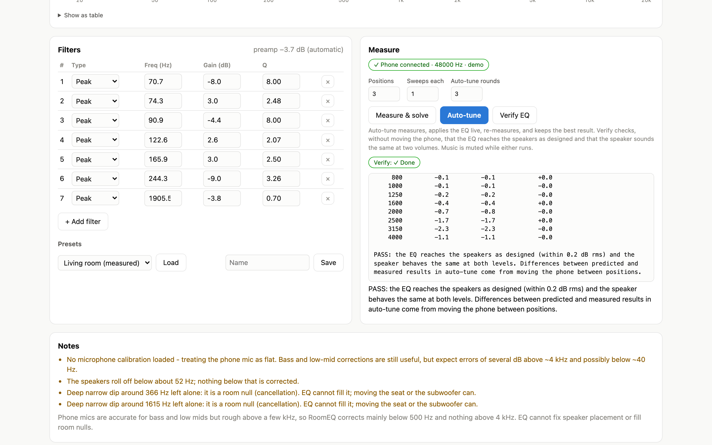
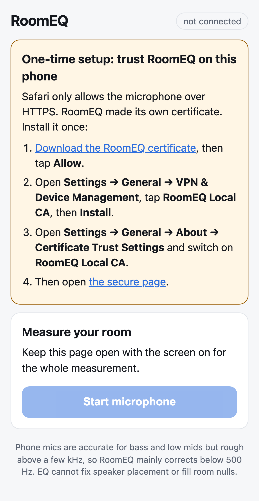
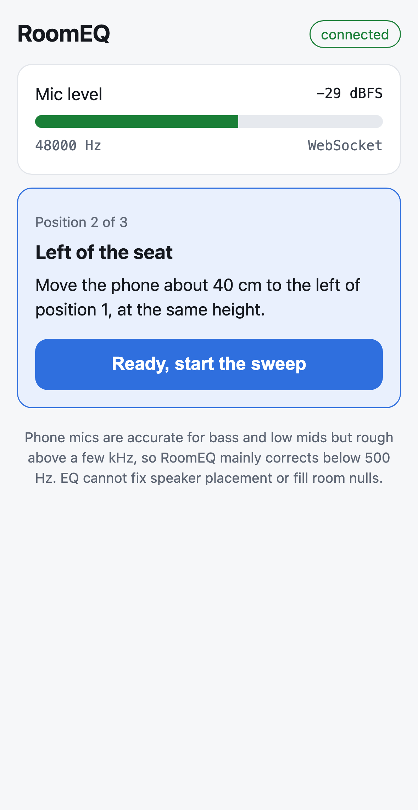
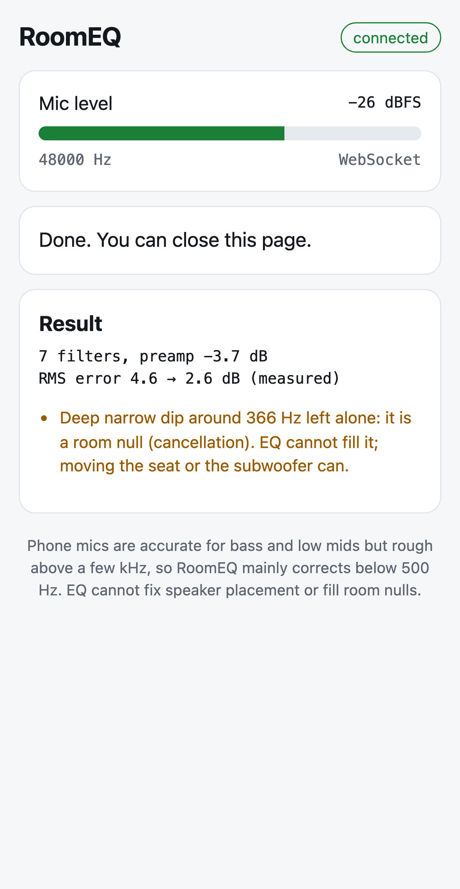
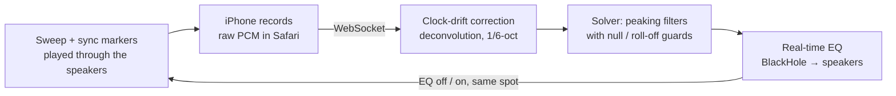

<div align="center">

# RoomEQ

**Automatic room correction for the Mac: measure your room with an iPhone, then hear everything through a real-time parametric EQ tuned to it.**


[**▶ Watch the 5-minute walkthrough**](docs/media/roomeq-walkthrough.mp4) ·
[Try it without hardware](#try-it-in-60-seconds-no-hardware) ·
[Architecture](docs/ARCHITECTURE.md) ·
[Setup guide](docs/SETUP.md)

<a href="docs/media/roomeq-walkthrough.mp4"></a>

</div>

---

## The problem

Small rooms wreck bass. Standing waves pile up 10–20 dB of boom at a few frequencies, while other notes
cancel out at the seat. Consumer room correction either needs a $100 measurement microphone and an
afternoon in REW, or it's locked inside expensive AV receivers.

**RoomEQ does it with the phone already in your pocket.** It plays a sweep through your speakers, the
iPhone records it in Safari, the Mac works out a parametric EQ that fixes what *can* be fixed, applies
it in real time to all system audio, and then **measures again to prove the improvement**.

## Results from a real living room

Measured with an iPhone 15 (no calibration file) on an F&D A521X 2.1 speaker system, three listening
positions, each compared with the EQ off and on *without moving the phone*:



| | Error vs target (RMS, roll-off to 4 kHz, nulls excluded) |
|---|---|
| Without EQ | ≈ 4.5 dB |
| **With RoomEQ, measured through the live EQ** | **≈ 2.5 dB** |

On the first run, with the subwoofer level set far too high, RoomEQ took the error from 9.0 dB to
3.5 dB and then told the user to turn the subwoofer down. That hardware change, plus a fresh
auto-tune, produced the result above.

## Features

| | |
|---|---|
| 📱 **iPhone as the microphone** | Safari page with raw 48 kHz PCM over a secure WebSocket; echo cancellation, noise suppression and AGC off; HTTP fallback; QR code to connect |
| 🎯 **Auto-tune** | Measure → solve → apply live → re-measure. Paired EQ-off/EQ-on sweeps per position make every reported improvement a fair, verified one |
| 🎛 **Real-time EQ for all audio** | Up to 16 biquads via BlackHole, glitch-free crossfaded updates, automatic preamp, level-matched A/B bypass, ~38 ms latency |
| 🛡 **Safe by design** | Look-ahead limiter, soft start, panic button (instant bypass −20 dB), validated presets, stacked-cut and boost limits |
| 🔬 **Honest DSP** | Never boosts room nulls or below the speaker's roll-off, corrects only where a phone mic is trustworthy, tells you when the fix is a knob, not an EQ |
| ✅ **Verify** | Four sweeps at one spot prove the EQ reaches the speakers as designed and that the speaker behaves the same at two volumes |
| 📊 **Dashboard** | Before/after/target charts with hover and table view, live meters, editable filters, presets, measurement progress, light and dark themes |
| 🧪 **Demo mode** | The complete app with a simulated room and virtual phone: try everything without speakers or a phone |

## Screenshots

<table>
<tr>
<td width="50%"><br><sub><b>Dashboard</b> with the real living-room measurement loaded (captured in demo mode, hence the badge)</sub></td>
<td width="50%"><br><sub><b>Auto-tune</b> running: paired EQ-off / EQ-on rounds (demo room)</sub></td>
</tr>
<tr>
<td><br><sub><b>Verify</b>: four sweeps at one position; the room cancels out (demo room)</sub></td>
<td><br><sub><b>Filters and presets</b>, light theme</sub></td>
</tr>
</table>

<table>
<tr>
<td width="33%"><br><sub>Phone, first visit: trust the local certificate</sub></td>
<td width="33%"><br><sub>Live level meter and position guidance</sub></td>
<td width="33%"><br><sub>Result and warnings on the phone</sub></td>
</tr>
</table>

## Try it in 60 seconds (no hardware)

```bash
brew install uv                 # if needed
git clone <this repo> roomeq && cd roomeq
uv sync
uv run roomeq demo --open       # dashboard opens; click "Auto-tune"
```

Demo mode runs the real engine, solver, measurement pipeline and dashboard. Only the outside world is
simulated: a music source, a small living room with a 2.1 system, and a phone that follows the
on-screen instructions. Time runs 12× faster while measuring, so a full auto-tune takes about 40 seconds.

## With your speakers and iPhone

```bash
brew install blackhole-2ch switchaudio-osx    # once, then log out and in
uv run roomeq autotune                        # scan the QR code with your iPhone, follow the prompts
uv run roomeq run                             # afterwards: the EQ, with the dashboard at localhost:8080
```

The [setup guide](docs/SETUP.md) covers device selection, the one-time iPhone certificate, measuring
tips, every command and the configuration file.

## How it works



1. **Measure.** A 20 Hz–20 kHz exponential sweep framed by two sync markers. The markers locate the
   recording and measure the phone-vs-Mac clock drift to well under 1 ppm, so the impulse response is
   recovered cleanly from a device with its own clock.
2. **Solve.** Greedy filter placement plus bounded least-squares refinement against a target with a
   gentle bass lift. Full correction below 500 Hz, gentle to 4 kHz, none above. Room nulls, the
   speaker's roll-off and position-dependent peaks are left alone on purpose.
3. **Apply.** Numba-compiled, allocation-free kernels: adaptive windowed-sinc resampler (tracks the
   drift between BlackHole and the speakers), two-bank EQ with crossfades, gain and look-ahead limiter,
   all in one compiled call per audio block.
4. **Verify.** Each auto-tune round measures every position with the EQ off and on without moving the
   phone, and keeps the round with the largest real improvement.

Read [ARCHITECTURE.md](docs/ARCHITECTURE.md) for the full design, including the
**problems found on real hardware and how each was solved**.

## Engineering highlights

- **Real-time audio in Python, done properly.** No allocation in the audio path, one compiled call per
  block, GC paused, worst-case callback 0.11 ms of a 5.3 ms budget while measurement analysis runs alongside.
- **Two-clock problem solved twice.** Phone ↔ Mac drift is measured from sync markers; BlackHole ↔
  speaker drift is tracked live by a PI-controlled resampler with timestamp-extrapolated buffer fill.
- **Measurements you can trust.** Per-band SNR from the deconvolved noise floor, coherence-based
  repeatability, automatic retakes, impostor-marker rejection, paired before/after comparisons.
- **Zero-setup secure phone link.** A local certificate authority and Apple-compliant server certificate
  give Safari the secure context its microphone needs; a tunnel is the fallback.
- **Portable DSP core.** Everything in `roomeq/dsp/` is pure NumPy/SciPy without I/O, written to port to
  Swift/vDSP for a native app.
- **Tested without hardware.** 70+ tests, including an end-to-end measurement over a real HTTPS
  WebSocket and full auto-tune runs through the live engine core in a simulated room.

## What it can't do

- **A phone microphone is rough above a few kHz**, so RoomEQ corrects mainly below 500 Hz and never
  above 4 kHz. A calibration file can be added if you have one.
- **No EQ can fill a room null or fix speaker placement.** RoomEQ detects nulls and says so; moving the
  seat, speakers or subwoofer is the real fix.
- **macOS only** (BlackHole + CoreAudio). The DSP core is portable; the audio routing is not.

## Project layout

```
roomeq/
├── dsp/            pure signal processing: biquads, sweep, analysis, solver, verify, real-time kernels
├── engine/         EngineCore (no audio API), CoreAudio streams, terminal UI
├── server/         FastAPI app, phone link, certificates, tunnel, static web UI (dashboard + phone page)
├── sim/            room, speaker and phone models
├── pipeline.py     measurement sets, paired rounds, auto-tune
├── jobs.py         measure / auto-tune / verify jobs on the live engine; dashboard state
├── demo.py         the whole app with a simulated world
└── cli.py          `roomeq` command
tests/              70+ tests, no hardware required
docs/               architecture, setup, troubleshooting, media
video/              narration script and recorder actions that produced the walkthrough
```

## Testing

```bash
uv run pytest          # about a minute
```

The walkthrough video is reproducible from `video/` (narration script, recorder actions, demo mode);
see [video/README.md](video/README.md).

## License

[MIT](LICENSE) © 2026 Koushik Roy

---

<sub>Built with Python 3.12, NumPy, SciPy, numba, sounddevice/PortAudio, FastAPI and uvicorn. Virtual audio
routing by <a href="https://github.com/ExistentialAudio/BlackHole">BlackHole</a>.</sub>
