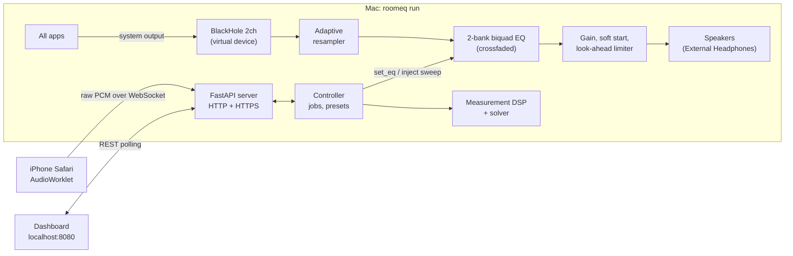

# Architecture

RoomEQ is three cooperating parts in one Python process, plus a web page on the phone:



| Layer | Package | Notes |
|---|---|---|
| Signal processing (pure, no I/O) | `roomeq/dsp/` | NumPy/SciPy only, written to port 1:1 to Swift/vDSP |
| Real-time kernels | `roomeq/dsp/rt_kernels.py` | numba-compiled, allocation-free, flat arrays |
| Engine | `roomeq/engine/` | `EngineCore` (no audio API) + sounddevice wrapper + terminal UI |
| Measurement orchestration | `roomeq/pipeline.py`, `roomeq/rigs.py` | hardware-agnostic `MeasurementRig` protocol |
| Jobs and dashboard state | `roomeq/jobs.py` | measure / auto-tune / verify jobs on the live engine |
| Server and phone link | `roomeq/server/` | FastAPI, WebSocket + HTTP fallback, local CA |
| Simulation | `roomeq/sim/`, `roomeq/demo.py` | room/speaker/phone models; the full app with no hardware |

## 1. Measurement

1. **Test signal** (`dsp/sweep.py`): 20 Hz–20 kHz exponential (Farina) sweep, framed by two identical
   300 Hz–8 kHz sync markers.
2. **Transport** (`server/static/phone.js`, `recorder-worklet.js`): `getUserMedia` with echo
   cancellation, noise suppression and AGC off. An AudioWorklet hands 2048-frame Float32 chunks to the
   main thread, which sends them with an 8-byte header (first-sample index, stream id). The server
   fills gaps with silence and drops duplicates (`server/link.py`), so a recording is always
   sample-continuous. If the WebSocket cannot open, the page falls back to chunked HTTP POST.
3. **Clock drift** (`dsp/analysis.py`): the phone's and the Mac's clocks differ by tens of ppm. The two
   markers pass through the same room, so the room cancels out of their spacing: cross-correlating the
   recorded markers with each other gives the drift to well under 1 ppm, and the recording is
   resampled before deconvolution. Marker pairs are only accepted within ±1000 ppm of the expected
   spacing and well above the correlation noise floor.
4. **Impulse response**: regularised spectral division (small regularisation in-band, large out of
   band) → peak-aligned window (10 ms / 500 ms, half-Hann tapers) → 1/6-octave power smoothing on a
   48-points-per-octave log grid.
5. **Quality**: clipping, level, per-band SNR measured against the *deconvolved* noise floor (the region
   between the room decay and the wrapped harmonic-distortion products), repeatability via
   magnitude-squared coherence, judged only where there is real signal. Unreliable sweeps are retaken
   automatically.

## 2. Solver (`dsp/solver.py`)

- Target: flat mids, smooth bass lift (+4 dB below ~100 Hz), −1 dB/octave above 2 kHz
  (`dsp/target.py`). The level is aligned on the median over 200 Hz–2 kHz.
- Correction zones: full strength below 500 Hz, gentle (≤ +2/−4 dB, Q ≤ 2) to 4 kHz, none above.
- Guards: low-frequency roll-off is detected and never boosted (nor within half an octave above it, nor
  below 35 Hz); deep narrow dips are classified as room nulls and never filled; boosts ≤ +3 dB and wide;
  cuts ≤ −9 dB per filter and −12 dB stacked; frequencies where listening positions disagree are
  down-weighted.
- Fit: greedy placement on the largest weighted deviation (Q from the deviation's half-width), then
  joint bounded least-squares refinement of all filters. Cuts weigh twice as much as boosts.
- Output: RBJ cookbook biquads and an automatic preamp computed from the *combined* response.

## 3. Real-time engine (`engine/core.py`, `dsp/rt_kernels.py`)

Per output callback, one compiled call (`process_block`) does:

```
ring buffer --> windowed-sinc resampler (32 taps, 512 phases) --> input meter
            --> [mute music / inject test signal] --> EQ bank A|B (warm-up + raised-cosine crossfade)
            --> master gain (soft start) --> 1.5 ms look-ahead limiter --> hard-clip safety --> device
```

- **No allocation in the audio path.** All buffers are preallocated; kernels work in place. The garbage
  collector is paused while audio runs, and the GIL switch interval is shortened so the CoreAudio
  threads get it quickly.
- **Glitch-free changes.** A new filter set is written into the inactive bank, runs silently for 150 ms,
  then crossfades in over 40 ms. If no audio is flowing, the change applies at once.
- **Clock drift between BlackHole and the speakers.** A PI controller keeps the resampler's buffer at
  its target. The fill level is extrapolated between input callbacks from timestamps, so the controller
  sees a smooth signal instead of a one-block sawtooth. If a device delivers in bursts, the target grows
  by a block after an underrun.
- **Safety.** Presets are validated (|gain| ≤ 15 dB, Q 0.1–20, ≤ 16 filters), the preamp never leaves
  positive headroom, volume trim can only attenuate, soft start on launch and after panic, non-finite
  filter state is reset to silence.
- **Measurements through the engine.** While a job runs, music is muted and the sweep is injected either
  before the EQ (measure *through* it) or after it (bypass), so auto-tune verifies the real live EQ.

## 4. Auto-tune (`pipeline.py`)

Round 0 measures the room without EQ at N positions and solves. Every later round measures each
position **twice, EQ off then EQ on, without moving the phone**, so each round's improvement is a fair
comparison. The EQ-off sweeps of every round are pooled into a better room average (and position
spread) for the next solve. The round with the largest measured improvement wins; if none beats
0.3 dB, the previous EQ is kept and nothing is saved.

**Verify** takes four sweeps at one fixed position: bypassed, through the EQ, bypassed 10 dB quieter,
bypassed again. `through − bypassed` must equal the designed EQ; `quiet + 10 − loud` must be flat
(otherwise the speaker has level-dependent processing); `repeat − bypassed` is the noise yardstick.

## 5. Phone security

Safari only grants the microphone in a secure context and does not apply "visit anyway" certificate
exceptions to WebSockets. RoomEQ therefore creates its own small root CA once (EC P-256, 10 years) and
issues a 397-day server certificate with SANs for the Mac's LAN addresses and `.local` name, following
Apple's TLS rules. The plain-HTTP page detects whether the phone already trusts the CA and either
redirects to HTTPS or walks the user through installing it. A cloudflared/ngrok tunnel is the
zero-setup alternative. Dashboard controls accept requests from the Mac itself only.

## 6. Problems found on real hardware, and the fixes

These came from running the app in a real room (MacBook Air, F&D A521X 2.1 speakers, iPhone 15), and
each one now has a regression test.

| Symptom | Cause | Fix |
|---|---|---|
| Drift controller saturated at 2000 ppm in simulation | buffer fill only observed in whole blocks: 90 ppm is invisible for a minute, then arrives as a 256-sample step | timestamp-extrapolated fill level + critically damped PI design |
| Steady underruns at 128-frame blocks on one device | the driver delivers several blocks at once | buffer target grows after an underrun; startup resyncs not counted as glitches |
| Worst audio callback 4.3 ms of a 5.3 ms budget during measurements | other threads took the GIL between the per-block Python calls | the whole block is one compiled call: worst case 0.11 ms with analyses running alongside |
| Auto-tune measured 6.8 dB "after" vs 1.8 dB predicted | the room's bass changes a lot between seats, and before/after came from different phone placements | paired EQ-off/EQ-on sweeps per position; position-spread weighting; −12 dB stacked-cut cap |
| One sweep reported +1648 ppm clock drift | the second-marker search window allowed ±13,000 ppm, so a reflection could win | plausible-drift window, multi-candidate marker pairing, peak-to-noise test, automatic retake |
| EQ hit its cut limit, bass still 10–15 dB high | subwoofer level set far too high | solver now says "turn the subwoofer down by about N dB" — the hardware fix beats any EQ |
| Quitting left the Mac silent | the system output was already BlackHole at start, so "restore" restored BlackHole | restore falls back to the configured speaker output |

## 7. Testing

`uv run pytest` runs 70+ tests in about a minute, with no audio hardware:

- **DSP**: biquad coefficients against the cookbook formulas, bandwidth/Q, shelves, time-domain gain,
  combined-response preamp.
- **Measurement**: recovery of synthetic rooms within 0.3 dB, drift from −80 to +150 ppm, 44.1 kHz
  phones, inverted polarity, clipping/noise flags, impostor markers, repeatability.
- **Solver**: recovers known peaks, never fills nulls, respects every limit, never boosts the roll-off,
  warns about an over-loud subwoofer.
- **Real-time**: kernel equals SciPy, switching produces no step larger than the signal's own slope,
  limiter ceiling, resampler THD+N below −70 dB at 48↔44.1 kHz, two minutes of free-running clocks at
  −150…+90 ppm without a glitch, bursty drivers, no memory growth over 5000 callbacks, NaN containment.
- **End to end**: a full measurement over a real HTTPS WebSocket with a CA-validated certificate; the
  dashboard API; auto-tune, cancel and verify through the live engine core with a simulated room;
  the unattended demo world.
